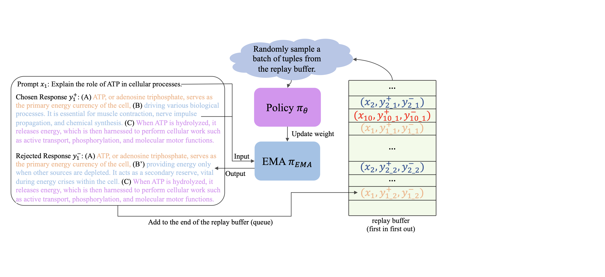

## Self-Augmented Preference Optimization: Off-Policy Paradigms for Language Model Alignment (SAPO)



This repository provides the official PyTorch implementation for the following paper:

**Self-Augmented Preference Optimization: Off-Policy Paradigms for Language Model Alignment** [[**Arxiv**]](https://arxiv.org/abs/2405.20830) <br> 
[Yueqin Yin](https://scholar.google.com/citations?user=HhEo-1cAAAAJ&hl=zh-CN)\*, [Zhendong Wang](https://scholar.google.com/citations?user=lRiIjhcAAAAJ&hl=en)\*, [Yujia Xie](https://scholar.google.com/citations?hl=en&user=r2FiAE4AAAAJ&view_op=list_works&sortby=pubdate), [Weizhu Chen](http://scholar.google.com/citations?user=LG_E-4EAAAAJ&hl=zh-CN) and [Mingyuan Zhou](https://mingyuanzhou.github.io/)<br>
(* denotes equal contribution)<br>
The University of Texas At Austin, Microsoft Azure AI<br>
> **Abstract:** *Traditional language model alignment methods, such as Direct Preference Optimization (DPO), are limited by their dependence on static, pre-collected paired preference data, which hampers their adaptability and practical applicability. To overcome this limitation, we introduce Self-Augmented Preference Optimization (SAPO), an effective and scalable training paradigm that does not require existing paired data. Building on the self-play concept, which autonomously generates negative responses, we further incorporate an off-policy learning pipeline to enhance data exploration and exploitation. Specifically, we employ an Exponential Moving Average (EMA) model in conjunction with a replay buffer to enable dynamic updates of response segments, effectively integrating real-time feedback with insights from historical data. Our comprehensive evaluations of the LLaMA3-8B and Mistral-7B models across benchmarks, including the Open LLM Leaderboard, IFEval, AlpacaEval 2.0, and MT-Bench, demonstrate that SAPO matches or surpasses established offline contrastive baselines, such as DPO and Odds Ratio Preference Optimization, and outperforms offline self-play methods like SPIN.*


## Installation
1. Clone this repo:
    ```bash
    git clone https://github.com/yinyueqin/SAPO.git
    cd SAPO
    ```
2. Install dependent packages:
A suitable [Anaconda](https://docs.anaconda.com/anaconda/install/) environment named `sapo` can be created and activated with:
   ```
   conda create -n sapo python=3.10
   conda activate sapo
   python -m pip install .
   python -m pip install flash-attn --no-build-isolation
   ```

## Training

For detailed script commands, please refer to the scripts in `scripts/sapo_dpo.sh` and `scripts/sapo_orpo.sh`.


## Citation

If you find this work useful for your research, please consider citing our paper:

```bibtex
@article{yin2024self,
  title={Self-Augmented Preference Optimization: Off-Policy Paradigms for Language Model Alignment},
  author={Yin, Yueqin and Wang, Zhendong and Xie, Yujia and Chen, Weizhu and Zhou, Mingyuan},
  journal={arXiv preprint arXiv:2405.20830},
  year={2024}
}
```

## Acknowledgement
This repo is built upon [SPIN](https://github.com/uclaml/SPIN/tree/main) and [TRL](https://github.com/huggingface/trl). We thank the authors for their excellent work.